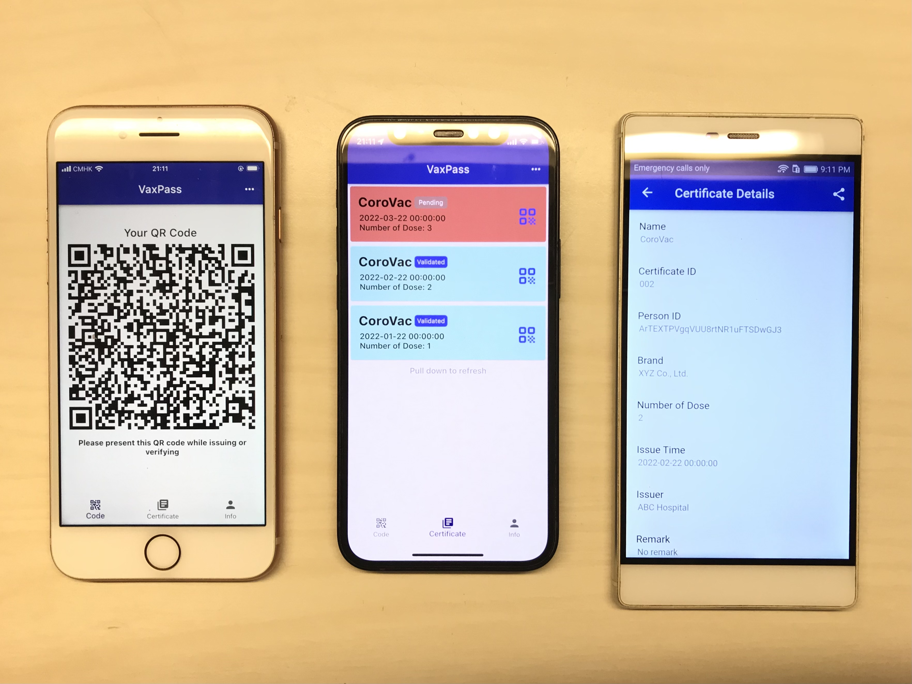

# VaxPass Mobile App

Mobile App client for VaxPass: Decentralized Two-Tier Verifiable Blockchain Platform for COVID-19 Certificate Verification

## Abstract

Many countries around the globe have adopted the COVID- 19 vaccine passport system to fight against Corona Virus and protect public health. In VaxPass, we introduce the design and implementation of VaxPass, an end-to-end decentralized blockchain-based vaccine passport verification system that provides a secure and reliable way for certificate storage, issuing, and verification. VaxPass utilizes a two-tier verifiable blockchain architecture for better scalability and maintainability. The first tier is the Global Chain, a Hyperledger Fabric permissioned blockchain whose nodes are maintained by the authorities in different countries. It only stores the membership proof of certificates to keep lightweight so that it is convenient to share data across the globe. The second tier is the Local Chains, which contains many blockchains held by different groups of institutions such as vaccine producers, hospitals, etc. Local Chains store detailed information on the certificates. Periodically, a certificate issuer generates a membership proof of all the certificates issued within the period and records it on the Global Chain. Then the certificate verifier can verify a certificate according to the proof on the Global Chain and the detailed information on the corresponding Local Chain.

## Demo



## Commands

Generate Launcher Icon:

In flutter_customer_client.yaml

```yaml
flutter_launcher_icons:
    git:
      url: https://github.com/Davenchy/flutter_launcher_icons.git
      ref: fixMinSdkParseFlutter2.8
```

Command:

```bash
flutter pub run flutter_launcher_icons:main
```
